# Vinter Architecture: VimScript Parsing Flow

This document describes how VimScript content is parsed and transformed into an Abstract Syntax Tree (AST) using Vinter's classes.

## Overview

Vinter uses a three-stage pipeline to process VimScript files:

1. **Lexer** - Tokenizes raw VimScript content into tokens
2. **Parser** - Transforms tokens into an Abstract Syntax Tree (AST)
3. **Linter** - Traverses the AST and applies lint rules

## Parsing Flow Diagram


## Detailed Component Flow


## Token Structure


## AST Node Structure

```mermaid
classDiagram
    class ASTNode {
        +Symbol type
        +Integer line
        +Integer column
    }
    
    class Program {
        +Array~ASTNode~ body
    }
    
    class DefFunction {
        +String name
        +Array~Parameter~ params
        +String return_type
        +Array~ASTNode~ body
    }
    
    class LegacyFunction {
        +String name
        +Array~Parameter~ params
        +Boolean has_bang
        +Array~String~ attributes
        +Array~ASTNode~ body
    }
    
    class VariableDeclaration {
        +String var_type
        +String name
        +String var_type_annotation
        +ASTNode initializer
    }
    
    class IfStatement {
        +ASTNode condition
        +Array~ASTNode~ then_branch
        +Array~ASTNode~ else_branch
    }
    
    class WhileStatement {
        +ASTNode condition
        +Array~ASTNode~ body
    }
    
    class ForStatement {
        +Token loop_var
        +ASTNode iterable
        +Array~ASTNode~ body
    }
    
    class FunctionCall {
        +String name
        +Array~ASTNode~ arguments
    }
    
    class BinaryExpression {
        +String operator
        +ASTNode left
        +ASTNode right
    }
    
    class Literal {
        +Any value
        +Symbol token_type
    }
    
    ASTNode <|-- Program
    ASTNode <|-- DefFunction
    ASTNode <|-- LegacyFunction
    ASTNode <|-- VariableDeclaration
    ASTNode <|-- IfStatement
    ASTNode <|-- WhileStatement
    ASTNode <|-- ForStatement
    ASTNode <|-- FunctionCall
    ASTNode <|-- BinaryExpression
    ASTNode <|-- Literal
```



## Example: Parsing a Simple Function

Given this VimScript:

```vim
vim9script
def Greet(name: string): string
    return "Hello, " .. name
enddef
```

### Step 1: Lexer Output

The following shows a simplified representation of the key tokens. The actual tokenization also includes whitespace tracking for line/column positions:


### Step 2: Parser Output (AST)


## Linter Rule Traversal


## Class Relationships


## Usage Example

```ruby
require 'vinter'

# Method 1: Using CLI
cli = Vinter::CLI.new
exit_code = cli.run(['path/to/script.vim'])

# Method 2: Using Linter directly
content = File.read('script.vim')
linter = Vinter::Linter.new
issues = linter.lint(content)

# Method 3: Using individual components
lexer = Vinter::Lexer.new(content)
tokens = lexer.tokenize

parser = Vinter::Parser.new(tokens, content)
result = parser.parse
# result = { ast: {...}, errors: [...], warnings: [...] }
```

## Summary

The Vinter parsing pipeline follows a classic compiler frontend architecture:

1. **Lexical Analysis (Lexer)**: Converts raw source code into a stream of tokens, handling VimScript-specific syntax like scoped variables (`s:`, `g:`), string literals, and operators.

2. **Syntactic Analysis (Parser)**: Builds a hierarchical AST from tokens using recursive descent parsing. Handles both legacy VimScript and Vim9 script syntax.

3. **Static Analysis (Linter)**: Traverses the AST to check for style violations and potential issues, using configurable rules.

This architecture allows for:
- **Extensibility**: New rules can be added without modifying the parser
- **Configurability**: Rules can be ignored via config files
- **Detailed Error Reporting**: Line and column information preserved through all stages
